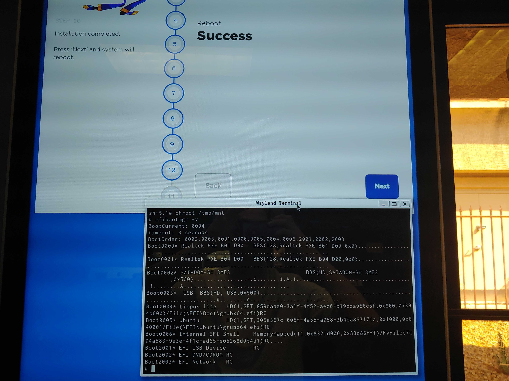

# EFI boot manager

This version works fine

```
/usr/sbin/grub-install \
    --target=x86_64-efi \
    --efi-directory=/boot/efi "$TARGET_DISK"
```

and this one creates a mess

```
/usr/sbin/grub-install \
    --target=x86_64-efi \
    --efi-directory=/boot/efi \
    --bootloader-id="My Super System" \
    --recheck "$TARGET_DISK"
```

By the "mess" I mean the following:

<figure><figcaption><p>Boot0002 and Boot0003 created by grub-install from chroot environment and do not work</p></figcaption></figure>

I think these records from efi NVRAM display that something is broken. It should not contain gibberish lines of random symbols. You need to remove them manually. If you run

```
efibootmgr -b 2 -B
```

run it twice - it will delete number 2 and will shift all entries up. So next time instead of 3 you need the number 2 again. Of course it's better to verify with `efibootmgr -v` .

Then create a proper one with this command

```
efibootmgr -c \
    -d /dev/sda \
    -p 1 \
    -l '\EFI\boot\grubx64.efi' \
    -L "Something that is not named ubuntu"
```

Here's a good documentation if you need extra help: [https://wiki.gentoo.org/wiki/Efibootmgr](https://wiki.gentoo.org/wiki/Efibootmgr)
